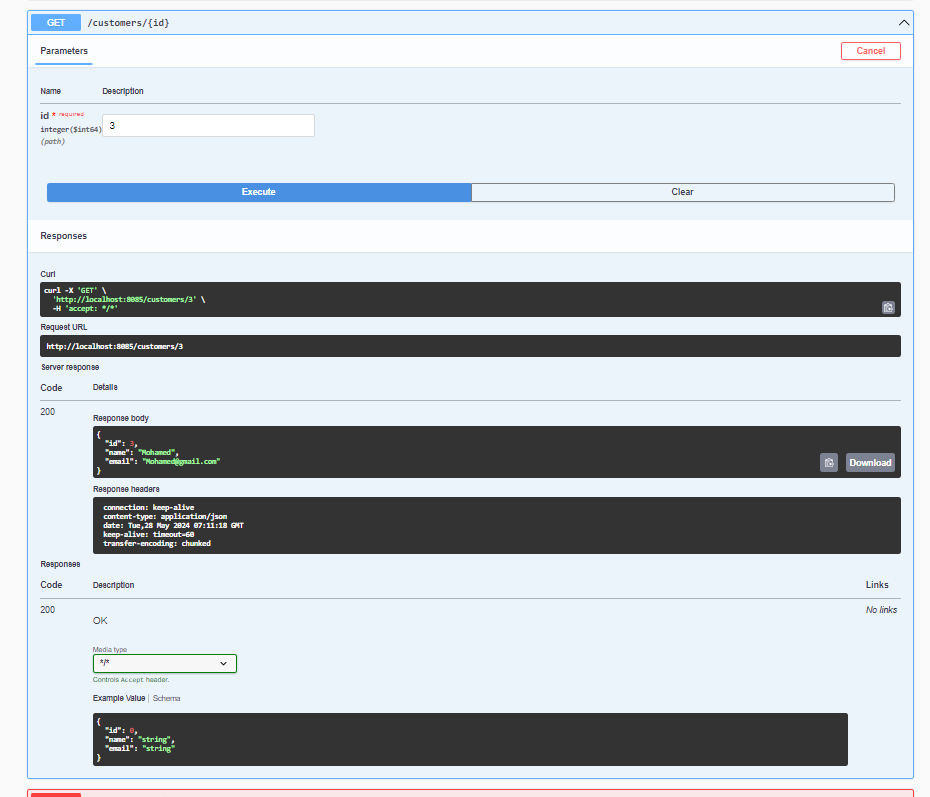
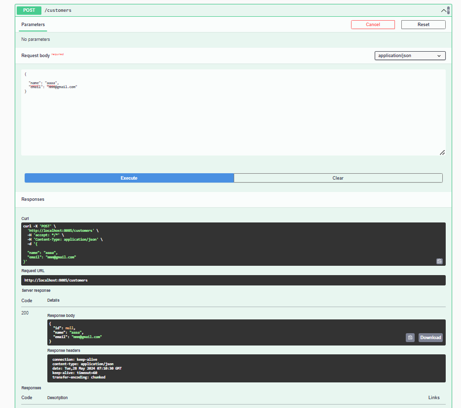
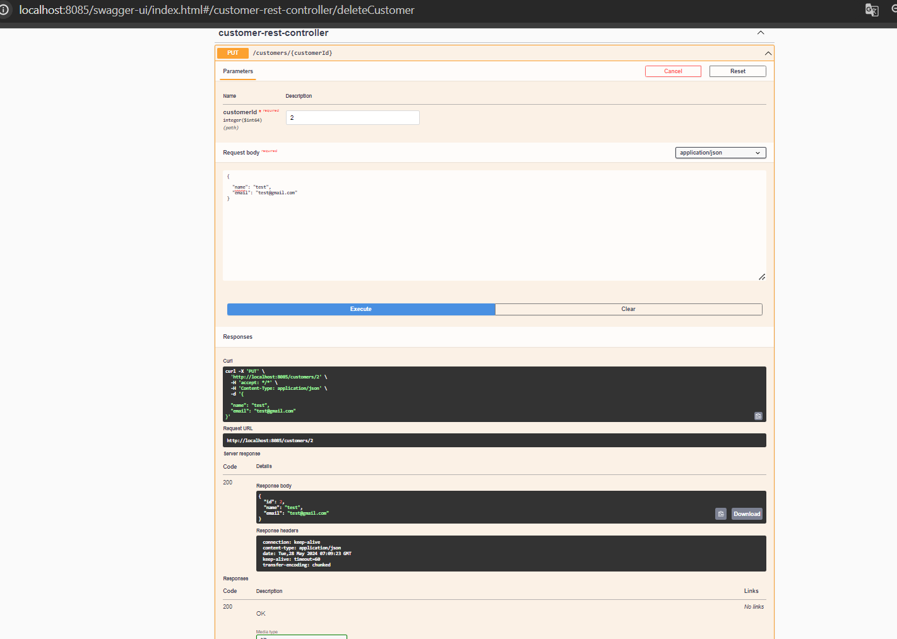
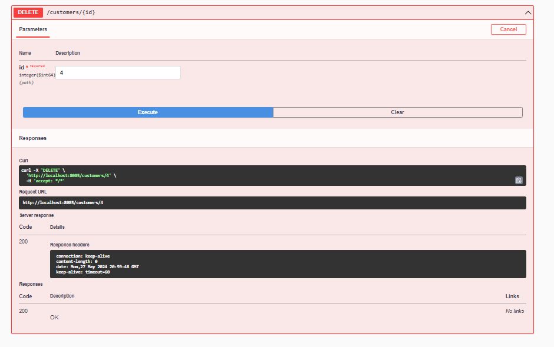
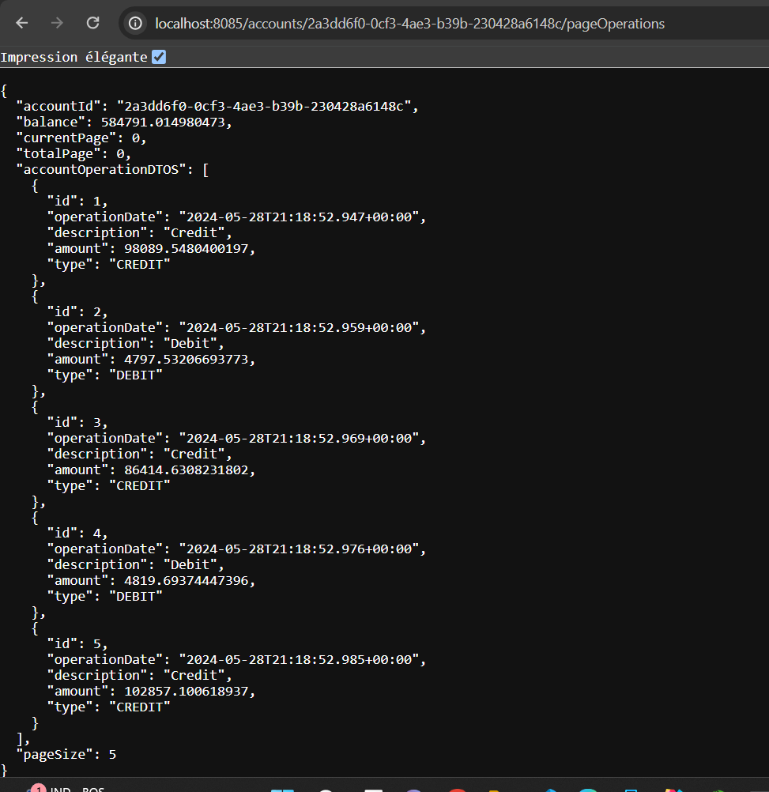

<h1>E-Banking Backend :</h1>

<h3> **** La partie Backend avec Spring: ****</h3>
<h5>Security : </h5>

<h4>Consulter tout les customers : </h4>

<h4>Consulter un customers : </h4>

<h4>Ajouter un customer: </h4>

<h4>Modifier un customers: </h4>

<h4>Supprimer un customers: </h4>

<h4>Consulter tout les accounts: </h4>

<h4>Consulter account : </h4>

<h4>Consulter Operations account : </h4>

<h4>Consulter History Operations account avec pagination : </h4>
